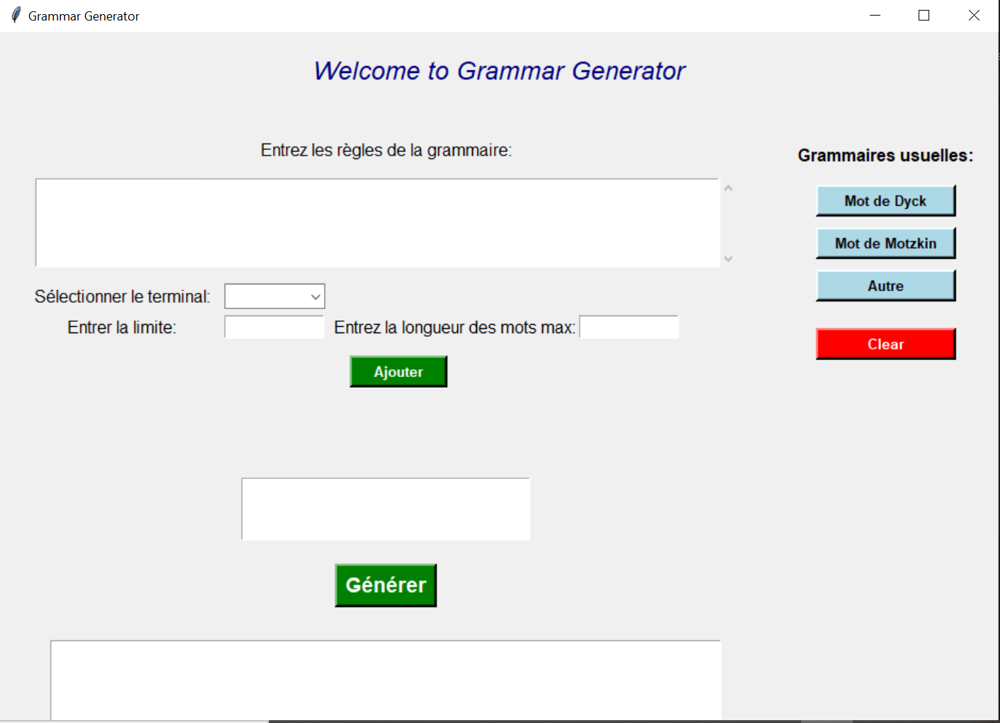

# Manuel d'Utilisation de l'Application Grammar Generator

## Introduction

L'application Grammar Generator vous permet de générer des mots à partir d'une grammaire donnée et de définir des contraintes spécifiques sur les terminaux. Vous pouvez également charger des grammaires à partir de fichiers et sauvgarder le resultat donné dans un fichier.

## Installation

Avant de commencer, assurez-vous d'avoir Python installé sur votre machine ainsi que les bibliothèques suivantes:
- **Tkinter**: pour l'interface graphique.
- **nltk** : pour la manipulation des grammaires.

Vous pouvez installer ***nltk*** avec la commande :
```bash
pip install nltk
``` 
## Interface de l'application

L'application se présente comme suit :
 

1. **Champ de Saisie des Règles de la Grammaire** : Entrez ici les règles de la grammaire que vous souhaitez utiliser.
2. **Sélectionner le Terminal et Entrer la Limite** : Sélectionnez un terminal spécifique et définissez une limite pour ce terminal.
3. **Entrer la Longueur des Mots Max** : Spécifiez la longueur maximale des mots que vous souhaitez générer.
4. **Bouton Ajouter** : Ajoutez la contrainte spécifiée sur le terminal sélectionné.
5. **Bouton Générer** : Générez les mots en fonction de la grammaire et des contraintes spécifiées
6. **Boutons de Grammaires Usuelles** : Chargez des grammaires prédéfinies (Mot de Dyck, Mot de Motzkin, etc.).
7. **Bouton Clear** : Réinitialisez tous les champs et contraintes.
8. **Liste des Résultats** : Affiche les mots générés.
9. **Bouton Sauvegarder** : Sauvegardez les mots générés dans un fichier.

## Instruction d'Utilisation
### Entrer une grammaire
Les règles de la grammaire doivent être saisies dans le champ prévu à cet effet, en suivant le format de la Grammaire Libre de Contexte (CFG). Voici comment formuler les règles correctement :

1. Format des Règles:
    - Chaque règle doit être définie sur une ligne séparée.
    - La règle est constituée d'un non-terminal suivi de ->, puis des productions possibles séparées par '|'
    - Les non-terminaux doivent être encadrés par des crochets angulaires '< >' ou simplement des majuscules.
2. Conventions:
    - Les productions doivent être séparées par des barres verticales '|'
    - Les chaînes terminales  doivent être entre guillemets simples ou doubles.
    - Les non-terminaux doivent être en majuscules ou encadrés par des crochets '<>' angulaires.
### Ajouter des contraintes
1. **Sélectionnez un terminal** dans la liste déroulante.
2. **Entrez la limite** pour ce terminal dans le champ prévu.
3. **Cliquez sur le bouton "Ajouter"** pour ajouter la contrainte.
### Spécifier la Longueur Maximale des Mots
1. **Entrez la longueur maximale des mots** dans le champ prévu à cet effet.
### Générer les Mots
1. **Cliquez sur le bouton "Générer"** pour générer les mots en fonction de la grammaire et des contraintes spécifiées.
2. Les mots générés s'affichent dans la liste des résultats.
### Charger une Grammaire Depuis un Fichier
1. **Cliquez sur le bouton correspondant** pour charger une grammaire depuis un fichier.
2. Sélectionnez le fichier contenant la grammaire au format CFG.
### Sauvegarder les Mots Générés
1. **Cliquez sur le bouton "Sauvegarder"** pour sauvegarder les mots générés dans un fichier texte.
Spécifiez le nom et l'emplacement du fichier.
## Exemple d'utilisation:

Voici un exemple d'utilisation de l'application:
-  Grammaire représentant les mots de dyck
-   l'application doit générer des mots qui contiennent max 4 'a' et 2 't' de longueur maximum 12